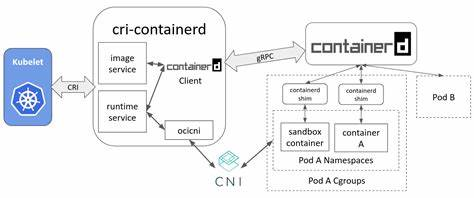
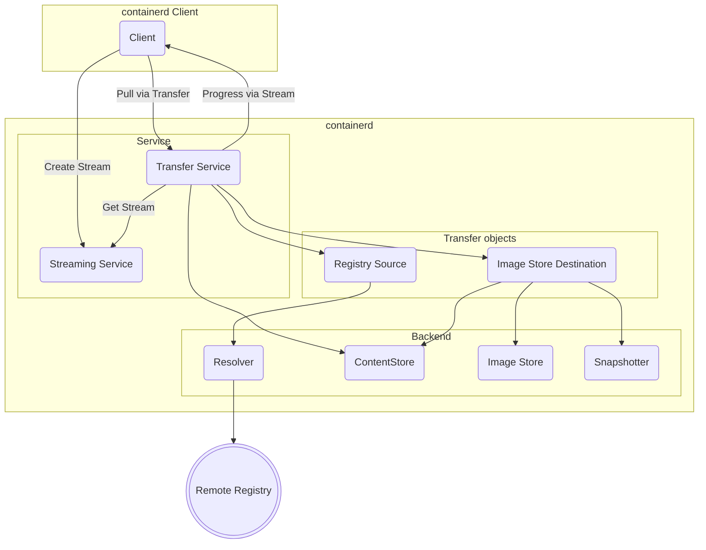
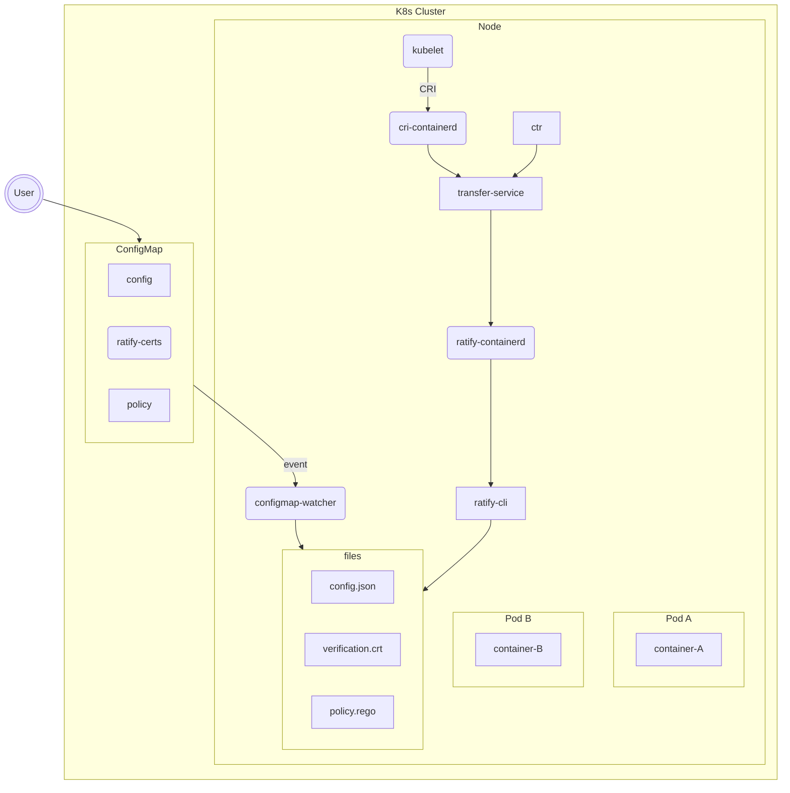

# Kubernetes Containerd Image Verification with Ratify

This document summarizes investigation done to enable Ratify as an image verifier in containerd. It explores both the current state of image verification in containerd as well as potential integration scenarios with Ratify. It shows an e2e prototype that uses experimental work to enable CRI to use the relevant containerd components.

[Github Repo](https://github.com/akashsinghal/ratify-containerd)

## Motivation

Image verification of supply chain artifacts has historically been implemented by admission controllers in Kubernetes. Admission controllers operate at the resource creation level in K8s and not at container runtime, where the image is pulled and run. Concerns over this gap between resource creation and container runtime have sparked new efforts to integrate image verification at the CRI level.

## Background

Read about containerd [here](https://www.docker.com/blog/containerd-vs-docker).

[Source](https://people.wikimedia.org/~jayme/k8s-docs/v1.16/blog/2017/11/containerd-container-runtime-options-kubernetes/#Architecture)

Containerd defines a `client`, as shown in the diagram above. This client is responsible for defining all content operations including image resolve, pull, and push. In Containerd v1.7.0, the `Transfer` service was introduced to delegate all content fetch operations. The transfer service is an alternative to the existing `client` implementation. The containerd roadmap shows that the transfer service will eventually be used as the default approach for content operations; however, the version 2.0.0 release will only support transfer service usage via the `ctr` cli. Read more about the transfer service [here](https://github.com/containerd/containerd/blob/main/docs/transfer.md).

Here is a high level diagram of the containerd Transfer service in a pull scenario.

In version 2.0.0, containerd is introducing new image verification capability. A user configured binary is invoked by a transfer service binary plugin manager during the pull operation. The output of the binary invocation determines whether or not the pull operation is allowed to complete. Image pull verification is only supported by the transfer service. For K8s scenarios, the CRI server implementation in containerd needs to be updated to use the transfer service instead of the existing containerd client. There is a PR that introduces this capability and the current PoC uses this version of the containerd.

## Goal

* Understand current state of image verification in Containerd transfer service including progress to update CRI to use transfer service
* Build a e2e prototype that can provide a user facing experience for configuring containerd on nodes to use Ratify as a image verification plugin.
* Evaluate the current gaps in functionality and what would need to be supported upstream in containerd and ratify.

## Proof of Concept

There are many components involved on the node after a resource is scheduled to run on a node. For simplicity, let's focus on the steps related to image pull (Note: this is a simplification and actual process is more nuanced):

1. Kubelet attempts to pull image from `cri-containerd`
2. Image does not exist in image store, so `cri-containerd` pulls image via `transfer-service`
3. `transfer-service` pull operation invokes configured `ratify-containerd` image verification binary with the image reference, digest, and manifest descriptor.
4. `ratify-containerd` binary invokes `ratify-cli` with a `config.json` file which references the `verification.crt` for notation verification and `policy.rego` as the policy file
5. `ratify-containerd` parses json verification report from `ratify-cli` and returns exit code 0/1 for failure or success. It also returns the entire report as the reason to stdout.
6. `transfer-service` continues pull based on exit code status of image verification plugins

Ratify requires 3 main components to execute:

1. The `config.json` contains all the configurations for store, verifier, and policy. It also contains references to the certificates and policy files to use.
2. The `verification.crt` is the public certificate notation verifier should use.
3. The `policy.rego` is the policy applied to the verifier report to determine an overall result.

All three files MUST be present on the node to perform verification. Configuration at the node is fairly cumbersome and requires elevated shell permissions on the node exposed to the user. To avoid this, the PoC implements a `configmap-watcher` daemon. This daemon uses the kubelet config to connect to the cluster api server. It then registers a watcher on a particular named ConfigMap resource and listens continuously for update/create/delete events. This daemon creates/updates/deletes each of the three files based on the configmap being watched.

### Implementation Details

Multiple services and binaries must be installed and restarted on the node. For ease of use, the prototype deploys a DaemonSet which runs a script on the node host. (Based on work scripts from [here](https://github.com/ganeshkumarashok/container-acceleration/blob/main/scripts/streaming/deployTeleport.yaml)). The script does:

* Installs a development version of `containerd` and `ctr` with CRI [updates](https://github.com/containerd/containerd/pull/8515) to use transfer service
* Installs necessary json and toml parsing tools
* Installs and starts configmap-watcher daemon service
* Installs `ratify-containerd` and `ratify` binaries
* Updates containerd config to use image verification
* Restarts containerd

Currently, a `ClusterRoleBinding` is required to provide configmap read access to the nodes. (Investigation required here on why kubelet doesn't have access by default)

Finally, a Configmap with a simple ratify config, verification certificate, and rego policy is defined.

## Learninings and Challenges

### Containerd

Containerd's support for image verification is promising but it is only implemented in the Transfer Service. The long term goal is that the transfer service will be the default way for all content operations; however, currently almost all clients do not support the transfer service. The few that do, `ctr` for example, do not use the transfer service as the default. Upstream contributions will be required to change clients to use the transfer service.

Image verification binary invocation is simple and basic which works for experimental purposes. It involves a binary to be invoked and a simple exit code and stdout parsing. However, daemon/service invocation may be required in which case, a defined api with a contract would be helpful.

Image verification is only implemented at the pull operation level. If nodes have existing images that are non compliant, containers that rely upon those images can still be created without verification. Ideally, image verification could also be performed by reference at container creation.

### Ratify

The current PoC relies upon the ratify cli being invoked. This is the natural choice currently since containerd invokes binaries per pull operation. Ratify CLI has many gaps. It does not have feature parity with external data provider support.

Features required for CLI:

* Key Management Provider
  * Inline support
  * Azure Key Vault
* Refactor Azure auth operations to support more auth scenarios (az cli, environment, MI, SP, etc.)
  * Update AKV KMP to use new auth support
  * Introduce new ORAS auth provider that uses new auth refactor

### Configuration

The current configmap-watcher looks for a specific named configmap in the default namespace. The ConfigMap CRUD operations should be RBAC restricted. Naming can conflict so the watcher should look into other way to identify (e.g via a label or dedicated CRD).

The config is required for Ratify to operate. There may be scenarios where the config is invalid or has been deleted. Should the plugin fail open or close? Should this be configurable?

### Performance

The Transfer service invokes the image verification binary per pull operation. Since the PoC is using the Ratify CLI, no certificate, auth, or registry content is cached between invocations which can lead to downstream service pressure with lots of calls.

Furthermore, when the verifier blocks the pull operation, the kubelet's default back-off-retry capability will continue to attempt to pull causing multiple redundant Ratify calls. This may affect throttling quotas for KMS and registries.

### Multi tenancy

Multi-tenant workloads can share the underling nodes. If each tenant defines policies, containerd would need a mechanism to be namespace-aware and partition verification accordingly. Currently, the pod sandbox config, which contains the resource config is not passed to the transfer service pull operation. Changes upstream would be required. Furthermore, the pull operation is not invoked unless the image does not already exist in the image store. The image store is not partitioned by namespace. A successful pull from one tenant onto a node would not invoke subsequent image pulls for other tenants. This would bypass image verification.

## Open Questions

* What role does runtime verification play? Does it replace admission controllers or work in conjunction?
  * Does Ratify work as an external data provider with GK plus at runtime?
  * Which artifact verifications will we want to perform at runtime vs admission time vs at pre-deployment (CD) time?
* What is the break glass behavior and how would it be implemented?
  * How can the user easily toggle enforcement?
* What is the audit functionality equivalent?
* How do we make sure image verification does not cause core cluster operations to fail?
* How do we make sure we can allowlist certain image references?
* What does the experience look like to install this in a cluster? DaemonSet? Baked into VM image?
